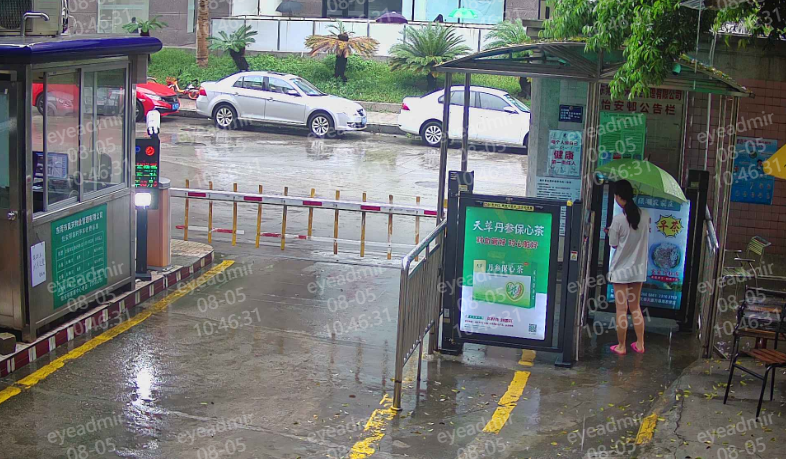
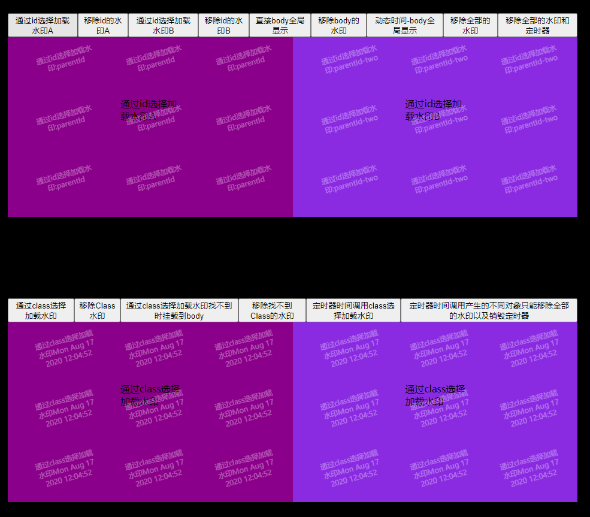

# photo-mark-tool

 # 基于shadowRoot和css3的pointer-events事件穿透属性和opacity透明属性 实现的水印工具
 * @author JuniorRay
 * @date 2019-12-08
 
The best watermarking tool-最好用的水印工具 ，支持 1.定时器调用； 2.静态调用；3.移除水印；4.移除全部水印

1.通过id选择加载水印；

2.直接body全局加载水印；

3.动态时间-body全局显示 

4.通过class选择加载水印；

5.通过class选择加载水印找不到时挂载到body；

6.定时器时间调用class选择加载水印

 效果展示：
 





 ##调用方式：
 
 
 1.定时器调用
 ```javascript
 setInterval(function () {
 
            window.photoMarkTool = null;//释放内存防止内存泄漏
            window.photoMarkTool = new PhotoMarkTool();
            window.photoMarkTool.removeAll();//权限级别最高，影响所有实例化元素
            var showMarkText = "水印内容" ;
            showMarkText = showMarkText+"<br/>"+"时间：";
            window.photoMarkTool.load({
                parentElement: ".parent-class",//被渲染元素，支持"#id",".className"
                content:  showMarkText  + new Date(),
                width: 100,
                height:50,
                color:'#ffffff',//水印字体颜色
                fontSize:"8px",
                isParentIdNotExistToLoadAtBody:true,//要渲染的元素parentElement找不到时是否挂载到body上面
            });


 }, 1*1000); //每1秒刷新一次  1000的单位是毫秒
 
```

 2.静态调用：
```javascript
 var photoMarkTool = new PhotoMarkTool();//每个实例化对象，只能影响到自己，和其他对象互不影响

 photoMarkTool.load({
 
            parentElement: "."+className,//被渲染元素，支持"#id",".className"
            content:  "通过class选择加载水印" + new Date(),
            width: 100,//水印小块宽度
            height:50,//水印小块高度
            color:'#ffffff',//水印字体颜色
            fontSize:"8px",
            isParentIdNotExistToLoadAtBody:false,//要渲染的元素parentElement找不到时是否挂载到body上面
 });
 
 //移除水印
 
 photoMarkTool.remove();//每个实例化对象，只能移除到自己，和其他对象互不影响

 //移除全部水印，暴力模式，权限级别最高
 
 photoMarkTool.removeAll();//可以影响到所有的实例化对象

 ```
 
 
